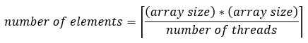
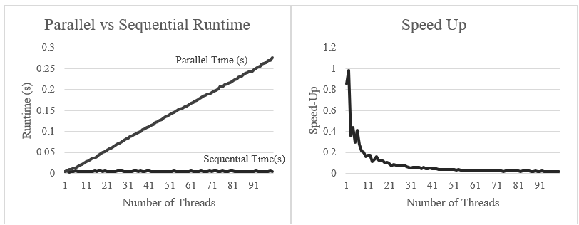
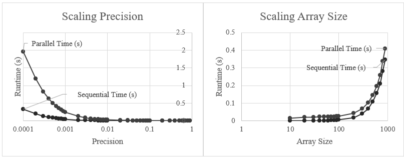
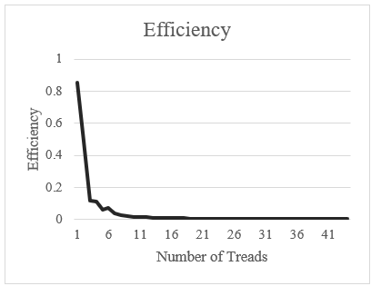

# Shared Memory Parallelization Coursework

George Madeley,
CM30225: Parallel Computing,
University of Bath
11-16-2022

## Abstract

A parallel super step algorithm implemented on a shared memory architecture with the purpose to reduce the overall runtime of computing the relaxation technique compared to a sequential implementation for varying input array sizes. Results show that for small input array sizes, the overheads of creating each thread and the time spent waiting at a barrier outweighs the time spent computing. As a result, the parallel implementation had a speed-up of less than one, decreasing as the number of threads increased from 1, and an efficiency of less than one, decreasing exponentially as the number of threads increased from 1. However, results suggests that as the input array size increases, the sequential implementation runtime may exceed the parallel implementation runtime thus making the parallel implementation a more viable means of computing the relaxation technique.

## Introduction

The relaxation technique is a method of solving partial differential equations by accepting a matrix of values and replacing each elements value by the average of those elements four neighbors. This is repeatedly performed until the difference between each elements current value and previous value is equal to or less that a given level of precision. As the size of the matrix increases, the computation time increases to the point where it may be inefficient to perform the calculations using sequential programming. The task therefore is to implement a solution to the relaxation technique using a shared memory architecture using parallel programming techniques with the aim of reducing the overall runtime.

## Design

Each thread is given an input and output array, a number of elements in the array to computer, a thread number relative to the total number of threads being used by the program, and the number of columns in the array. Using these values, each thread calculates the index of the input array that thread should start from. Each thread calculates the average of each elements four neighbors starting from the starting index to the starting index plus the number of elements assigned to each thread. Via this method, no thread calculates an already calculated value.
Once a thread has calculated an elements average, it stores the results in the element corresponding position in the output array and it calculates the difference between the current average and the previous average. If this difference is not equal to or less than a given precision, this thread, and all other threads, will have to perform another iteration of calculating the average of each elements for neighbors. Resulting in a super step styled algorithm where each thread computes the averages of each element assigned to that array then waits for all other threads to complete their calculations before repeating the process if any element has not reach the required level of precision.
To ensure each thread can perform its task successfully, the sequential part of the code needs to copy the input array, assign each thread a unique value from zero to the specified number of threads, and needs to calculate the number of elements each thread should be assigned:

This equation ensures that the average of each elements four neighbors will be calculated whilst also ensuring each thread calculates the averages for the same number of elements therefore reducing the wait time between each super step. The equation does cause out of bounds issues, therefore, if statements will be added to prevent threads from exceeding the bounds of the input array.
Once all elements have reached the required level of precision, the resulting output array can then be returned.

## Method

### Sequential Implementation

This equation ensures that the average of each elements four neighbors will be calculated whilst also ensuring each thread calculates the averages for the same number of elements therefore reducing the wait time between each super step. The equation does cause out of bounds issues, therefore, if statements will be added to prevent threads from exceeding the bounds of the input array.
Once all elements have reached the required level of precision, the resulting output array can then be returned.

### Parallel Implementation

#### Sequential Part

Before any threads can be created, a set number of required variables need to be defined. Memory is allocated to the input and output arrays so that each thread can read only from the input array and write only to the output array therefore reduce the risk of data race conditions occurring. Memory is allocated for the given number of threads and their respective arguments. This is done to ensure the arguments are not changed in the for loop that creates each thread therefore preventing a race condition during thread creation. The number of elements each thread should be assigned is calculated using the equation stated above. Finally, a globally defined barrier is initialized. Each thread is then created and passed the function to run and the required arguments.

#### Parallel Part

Each thread is given a thread number relative to the total number of threads. Using this, the number of elements assigned to each thread, and the size of the matrix, each thread calculates the index of the input array it should start at. Each thread then starts calculating the average of four neighbors of each element from the threads starting index to the starting index plus the number of elements allocated to each thread . Each thread then stores the result in that elements corresponding position in the output array.
This only performs one iteration of the whole matrix, therefore to perform multiple iterations, the process above is looped until the difference between every elements previous and current value is equal to or less than the given level of precision. This is performed by having a local and a global Boolean value which represents whether every element allocated to a thread has met the precision, and whether every thread in the matrix has met that required level of precision, respectively. Both values are set to true at the start with the assumption that the elements have already met the required level of precision. If an element, allocated to a thread, has not met the required level of precision, the threads local assumption is changed from true to false. If an element has met the required level of precision, it does nothing. After an iteration has been calculated, if the local value of a thread is false, then the global value is changed to a false. Else, the program does nothing .
Each thread then sets it local value to the global value. This tells each threads whether the whole matrix has reached the required level of precision and whether the threads needs to perform another iterations. However, to avoid a data race condition from occurring, a barrier is used in between the write to the global and value and the read from the global value. After each thread has read the global value, the global value is reset back to true. Again, to avoid a data race, a barrier is placed before this write. Finally, a third barrier is used to synchronizes all threads after the finally write command to avoid a data race when each thread writes to the global value again if another iteration is required. See Appendix Flowchart of Each Threads Code for a diagram of how this process operates.
After each iteration, the address of the input and output array are swapped to preserve reading from one array and writing to another, therefore reducing the risk of a data race occurring.
Once all elements have reached the required level of precision, the threads finish processing and the address of the input and output are swapped to ensure the output pointer points to the output array and not in the input array. The output array of the parallelized method is compared to the output of the serial method to check if the output of the parallelized method is correct . Finally, the output is printed to the console and the allocated memory is freed.

## Testing

A series of tests were conducted to ensure the program produced the correct output, to investigate the speed-up and efficiency of the program, and to eliminate memory leakages and conversion errors for a series of different number of threads, array sizes, and precisions.

### Correctness Testing

To ensure the program produced the correct output, a sequential implementation was coded to compare the outputs of the sequential and parallel implementations. If the parallel output did not match the serial output, it is assumed that the parallel output was computed incorrectly.
A Thousands tests were conducted using five threads and twelve-by-twelve matrix with each thread being capped at only one iteration to ensure that a random error did not occur. Following this, 100 tests were conducted on every number of threads between 1 and 44 to ensure that a certain number of threads did not cause an incorrect correct output. Once all tests passed, the cap on the number of iterations each thread was allowed to computer was removed and the tests mentioned above were performed again. The number of threads in use, the test number, and whether the program passed were printed to the console. Once all the tests had passed, other investigations could be conducted.

### Scalability Testing

#### Speed-Up

If one were to take Amdahl’s approach and scale the number of threads being used by the program with a fixed array size of 100x100 and a fixed precision of 0.01, the time taken to compute the parallel part of the program increases linearly. This is due the time taken for the creation of each thread. With a problem of this size, the time it takes one thread to compute the average, of each elements four neighbors for each element that thread is assigned, is shorter than the time it takes for a single thread to be computed. Therefore, the more threads the program uses, the less elements are assigned to each thread, the more time spent creating threads rather than computing the averages of each elements four neighbors. Therefore, scaling the number of threads is not a suitable solution.

One could take Gustafsons approach and test with a larger sized input array or a smaller precision to increase the runtime of the program but in turn reduce the fraction of the runtime taken up by creating each thread.
When scaling the precision, the time taken by the parallel method grows exponentially. This is due to a number of things. The level of precision is inversely proportional to the number of iterations each thread has to calculate. The level of precision is not however, related to the number of elements assigned to each tread. Even though we do increase the problem size, this does not increase the time taken per iteration, therefore, during the first iteration, a large number of threads will be left waiting for other threads to complete their calculations due to the time taken by the core to create each tread. In addition to this, some threads could be faster than others. As we decrease the required level of precision, and therefore increase the number of iterations, we are increasing the total time fast threads are waiting at a barrier for slow threads to finish their computations. Scaling the required level of precision is not a viable means of scaling the parallel program.
As the size of the input array increases, runtime of both the sequential and parallel implementations increase proportionally however, the larger the input array, the smaller the difference between the sequential and parallel runtime. This is because the size of the array is directly proportional to the number of elements assigned to each thread. Therefore, as we increase the size of the array with a fixed number of threads, the percentage of time taken up by the creation of threads within the first iteration decreases. As the size reaches infinity, the proportion of time taken up by the thread creation becomes negligible. Therefore, there is an array size where the parallel implementation has a speed-up that is equal to or bigger than one.

#### Efficiency

The efficiency of each number of threads shows that as we increase the number of threads, the larger the proportion of a threads computation time is taken up by waiting. This is due to the time spent waiting to create the given number of threads, the time spent waiting at the three barriers for slow threads to finish their computation and the sequential read/write access to the global precision value.
Using the given array size and precision to work to, the current parallel implementation is not efficient nor does it have an adequate speed-up bigger than one. The three main reasons for this is the time each thread spends waiting for other threads to be created, the time ‘fast’ threads spend waiting for ‘slower’ threads to finish their computation, and the serial access to the global value of precision.

## Conclusion

The parallel algorithm implemented to perform the relaxation technique for differential equations utilizes a super step based design and assigns each thread a set number of elements to compute. Due to barriers in the program and the creation time of each thread, the program is not efficient nor does it have a speed-up bigger than one. Therefore, a sequential implementation would be a better fit to perform the relaxation technique for differential equations for small sized array. However, results suggest that as the input array increases, it may be more beneficial to use this parallel algorithm for performing the relaxation technique for differential equations.
